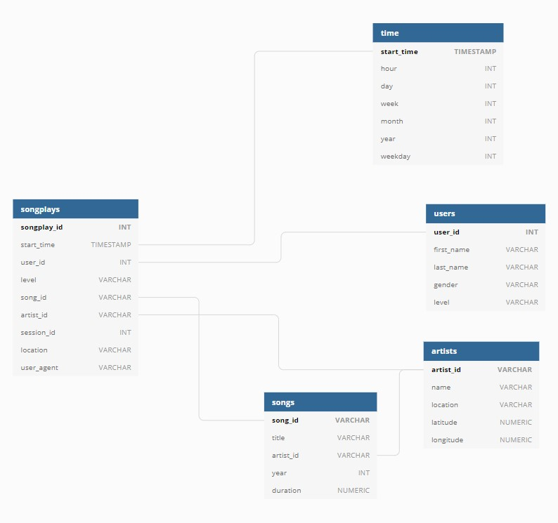

# Project 1: Data Modeling with PostgreSQL
## Purpose of the Database
The database contains the log dataset as well as the song dataset. This allows the company, Sparkify, to even conveniently see and analyze the corresponding datasets. Further, they could upgrade the quality of their product more user-friendly by doing different analysis with this database. For instance, they could see which hours the users start to listen to the music, which can lead to estimating the amount of profit they could earn from adding certain ads. In addition to this, Sparkify can determine the country or city they're most/least popular in, and this also could lead to the marketing decisions.

## ETL Pipeline
1. Table Creation and Data Extraction/Insertion for Dimension Tables
    1. Processes the song dataset by using pd.read_json(filepath)
        1. artists Table
        2. songs Table
    2. Processes the log dataset by using pd.read_json(filepath)
        1. time Table - This table is sourced from the `ts` column in the log files. The `ts` column was initially in `BIGINT`  (milliseconds), but converted into `TIMESTAMP` in `start_time` column. This got divided into hour, day, week, etc. columns in time Table.
        2. users Table
2. Table Creation and Data Extraction/Insertion for Fact Table
    1. Create `song_select` query in __sql_queries.py__ file in order to find the song_id and artist_id based on the title, artist name and duration of the song.
        1. songplays Table - the columns are taken from the dimension tables
        
## Datasets
### Song Dataset
This is the subset of the real data from the [Million Song Dataset](http://millionsongdataset.com/). Each data is in JSON format and constains metadata about a song and the artist of that song. This dataset is directly related to creating the __artists Table__ and __songs Table__.

### Log Dataset
This is the log files in JSON format generated by [this event simulator](https://github.com/Interana/eventsim) based on the songs in the Song Dataset above. This dataset is directly related to creating the __time Table__ and __users Table__.

## Schema

1. __songplays__
    - Fact Table
    - records in log data associated with song plays
2. __users__
    - Dimension Table
    - users in the app
3. __songs__
    - Dimension Table
    - songs in music database
4. __artists__
    - Dimension Table
    - artists in music database
5. __time__
    - Dimension Table
    - timestamps of records in songplays broken down into specific units

>## How to run ETL process
> 1. Run `create_tables.py` in order to create or drop tables.
> 2. Run `etl.py` to extract and insert data from song and log datasets in the `data` folder. This step assigns data to the corresponding column in the right table.
> 3. Run `test.ipynb` to check if the tables or data are correctly created or assigned. You can try additional queries in this file.
> 4. To run `create_tables.py` again after some modification, you need to restart the kernal in `test.ipynb` file.
